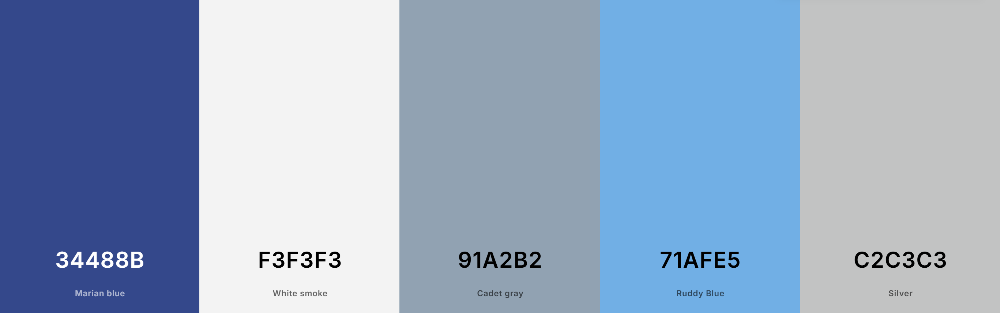
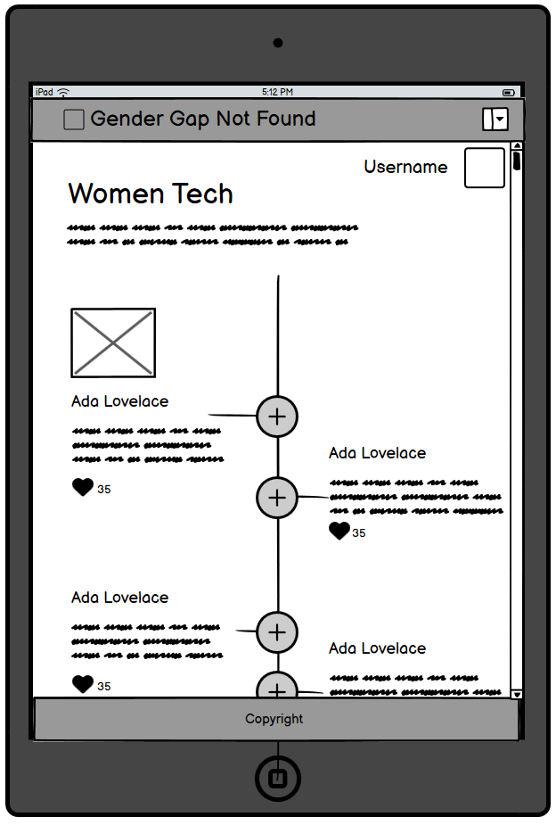
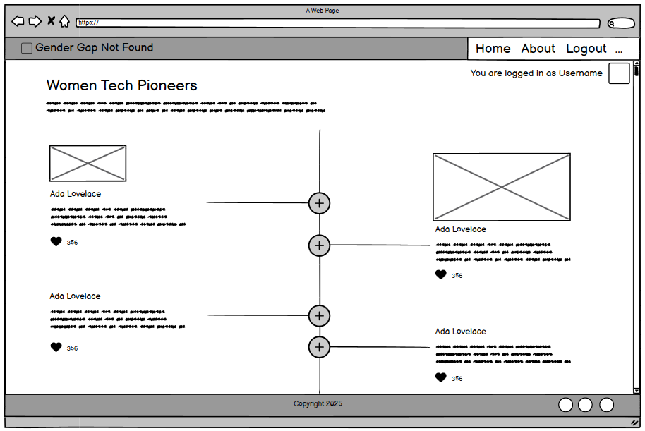

# 404: Gender Gap Not Found - Inspiring the Next Generation of Women in Tech


## User Experience

### Site Goals
Our app is designed to inspire the next generation of tech innovators by:
- sharing stories of women pioneers in tech
- providing handy tips into tech
- bridging the mentorship gap for women in technology by connecting mentees with mentors who can guide their professional journeys.

The web app aims to break barriers, close gender gaps and cultivate a diverse and inclusive tech community where women can thrive as innovators, leaders and changemakers. It’s not just about mentorship — it’s about building a stronger future for women in technology.

Live site: [https://team-1-8284bb86c76b.herokuapp.com/](https://team-1-8284bb86c76b.herokuapp.com/)

### Target Users
- General Users: Visitors interested in exploring the key milestones of women in tech to learn about their achievements and biographies.
- Students and Learners: People using the site to explore role models and gain guidance from mentors.
- Authenticated Users: Registered users who can access additional features like connecting with mentors and honouring women tech icons on the timeline.
- Researchers: Individuals seeking inspiration or information about notable figures featured in the timeline.
- Administrators: Users responsible for managing content like timeline entries, biographies and connections to mentors.

## Design

### Colour Scheme
We draw from a palette of colours commonly found on operating systems in the 90's, taking inspiring from the cool retro colours of the Windows 98 operating system:


### Fonts
The site uses a selection of fonts inspired by Web 1.0 pages from the late 1990's:

**Gentium Book Basic**
This is a timeless serif font designed for readability, featuring elegant letterforms and support for a wide range of languages and scripts, making it ideal for the biographies.


### Wireframes
Based on the user stories, we used Balsamiq to design the wireframes for the main UI, starting with mobile first.


<details>
  <summary>Header and Footer</summary>
    Here are the wireframes for the site with its header and footer:


</details>
<details>
  <summary>Contact a Mentor</summary>
    Here are the wireframes for contact form for connecting with a mentor:


</details>
<details>
  <summary>Timeline</summary>
    Here are the wireframes for timeline:

   
      
    
</details>

## Agile Methodology

### Kanban Board
All user stories were logged on the [Kanban Project Board](https://github.com/users/tgrey2024/projects/21) on GitHub Projects.

We also used it during testing to log any significant bugs that need to be fixed before the deadline. These were then assigned and prioritised alongside other issues and user stories.

### User Stories
Here are all the user stories that have been prioritised for the current implementation:

| User Stories                                   | MoSCoW priority | Status |
| :--------------------------------------------- | :-------------: | :----: |
| User-Friendly Navigation and Responsive Design |    must have    |  Done  |
| Display Timeline View                          |    must have    |  Done  |
| Header and Footer                              |    must have    |  Done  |
| User Authentication                            |    must have    |  Done  |
| Connect with Mentors                           |    must have    |  Done  |
| Team page                                      |    must have    |  Done  |
| Custom Error Pages                             |   should have   |  Done  |


## Features

### Header

#### Header Section Overview
The header of this project is designed with a retro-modern and responsive layout to provide easy navigation across the site, with a touch of 1980s. It includes the following key components:
### Structure and Design
#### Background Gradient
* The header has a linear gradient that transitions from a dark blue (#000080) to a light sky blue (#87CEFA), giving it a visually appealing look. The text color is white, ensuring good contrast and readability.
#### Logo
* The logo is placed on the left side and links to the home page. It's styled to ensure that it fits well in the header without distorting or overflowing, using a max-w-full and max-h-full approach.
#### Navigation Links
* The horizontal navigation menu is displayed on larger screens (medium and up, md breakpoint) with links to key pages: Home, Timeline, Mentors, Team, Login and Register. These links have hover effects for better user interaction.
* If the user is authenticated, additional links for "Logout" and "Change Password" are displayed. Otherwise, users will see the "Login" and "Register" options.
### Mobile Responsiveness
* On smaller screens, the navigation links are hidden, and a hamburger menu (navbar-burger) appears.
* When clicked, it toggles a dropdown menu (navbar-dropdown) showing the same navigation links as in the desktop version.
* The dropdown menu is styled to appear below the hamburger button with a light background and rounded corners.
### Footer

* The footer is styled with a dark blue background (#000080), white text, and a subtle border on top.

* The text is centered, and the font is set to a monospace style (font-mono), with a small size (text-sm).

* It includes a copyright notice with the text "404 Gender Gap Not Found - Since 1900", followed by "All Rights Reserved".

* This footer is fixed at the bottom of the page (mt-auto), ensuring it stays at the bottom even if content above it is not enough to fill the screen.

### Timeline
* The timeline feature is a tribute to the trailblazing women who have shaped the world of technology through their pioneering achievements, starting with the pioneer, Ada Lovelace, often hailed as the world's first computer programmer. It presents an engaging and interactive journey through history, highlighting key figures and their groundbreaking contributions to fields like computing, engineering, game design, web accessibility and more. Each entry includes a snapshot of their life, notable accomplishments and the lasting impact of their work, providing inspiration for users of all ages. By showcasing these remarkable stories, the timeline not only honours these innovators but also encourages future generations to follow in their footsteps and continue breaking barriers in tech.

#### Read more
* The user is invited to know more about any figure by clicking on the Read more button to find out more about each tech icon.

#### Honor Her - Heart
* Users can honors the women featured on our timeline by giving them a heart - clicking on the heart icon.

### Tips
### Contact Mentor Form
* User may find a mentor from the pool of mentors on our mentors page.
* If a user finds no matching mentor right away, the user may click on the "Find a mentor" button
* A contact a mentor window will pop up and the user may provide his/heremial, mentor name and a message.
* The sytem will then try to match the user with a mentor.
### Admin Panel
The Admin Panel is set up for the admin or superuser to access and update the data in the database.

### Custom Error Pages
<!-- Add content for Error Pages here -->

### Future Features


## Testing

### Manual Testing
<!-- Add content for Manual Testing here -->
WCAG Accessibility and Contrast checking Extension

## Bugs

### Known Bugs
<!-- Add content for Known Bugs here -->

## Technologies And Languages

### Languages Used
- HTML5 - for content and structure on the site.
- CSS - for styling the site.
- Python - provides functionality for the site.
- Django - as the Python framework for the site.
- Javascript - for interactive and dynamic elements of the site.

### Technologies
- node.js

### Deployment and Version Control
- Git
- Github
- Heroku
- Whitenoise - for serving static files
- Cloudinary - for image storage

### Styling
- Tailwind CSS - for responsive design
- FlyonUI - for styling timeline, etc.
- Tabler - for icons

### Authentication
- Django AllAuth

### Tools
- VS Code - IDE for development
- Balsamiq - for wireframes
- Canva
- LogoAI - for AI logo
- Favicon.io - for favicons
- Copilot - AI content generation

Here’s a polished, easy‑to‑read **Markdown** version of your Local Development Setup instructions:

---

## 🛠️ Local Development Setup

Follow these steps to get the project running on your machine.

### 1️⃣ Clone the Repository

```bash
git clone https://github.com/tgrey2024/2503-hackathon-team1.git .
```
> The trailing `.` tells Git to clone into your **current directory**.

---

### 2️⃣ Install Python Dependencies

```bash
pip install -r requirements.txt
```

---

### 3️⃣ Configure Environment Variables

Create a `.env` file in the project root containing:

```dotenv
SECRET_KEY=<your_secret_key>
DEV=1
```
- **SECRET_KEY**: any secure random string
- **DEV**: enables Django’s debug mode for local development

---

### 4️⃣ Install Tailwind CSS

```bash
python manage.py tailwind install
```

---

### 5️⃣ Apply Database Migrations

```bash
python manage.py migrate
```

---

### 6️⃣ Start Development Servers

For the smoothest workflow, open **two terminal windows**:

| Terminal | Command                           | Purpose                         |
| -------- | --------------------------------- | ------------------------------- |
| 1        | `python manage.py tailwind start` | Watch & compile Tailwind CSS    |
| 2        | `python manage.py runserver`      | Start Django development server |

Once both are running, visit http://127.0.0.1:8000 in your browser to see the app live.

---


## Deployment
The web app is hosted on Heroku using Eco Dynos, and is deployed via the designated Github repository.

The deployment process is as follows:
1. Login to your GitHub profile and **Create a new repository**.
2. Open VS Code locally, connect and open the workspace. Create the MVP.
3. Install web server gunicorn and freeze requirements.
4. Create a new Procfile in the root directory and specify the running of the web app with process type as gunicorn in the Procfile.
5. Add deployed apps to ALLOWED_HOSTS in settings.py, and set Debug = False. Add, commit and push to the Github repo.
6. In Heroku, create a new app using a unique name and select the correct region.
7. Add Config Vars in Settings.
8. Go to Deploy tab, search for the correct Github repo and **Deploy Branch**.
9. Choose **Automatic Deploy**.
10. **View app** to verify that it is been deployed correctly. This deployed site can now be validated and tested e.g. in Chrome Dev Tools.
11. In the app's Resources tab, check that Eco Dynos are used and remove any unnecessary Add-ons.
12. Subsequent changes to the code will need to be pushed to the Github repo and deployed on Heroku.

## Creating A Fork
1. On Github navigate to repository
2. click "Fork" located towards the top right corner
3. Select "owner" for the forked repo, from the dropdown menu under "owner" Under "Owner"
4. It will create forked repo under the same name as orinial by default but you can type a name in "Repository name" or add a description in "Description" box.
5. Click "Create fork" !

Forking allows you to make any changes without affecting original project. You can send the suggestions over by submitting pull request. Project owner can review the pull request before accepting the suggestions and merging them.


For more details on how to fork the repo, in order to for example suggest any changes to the project you can visit:
https://docs.github.com/en/get-started/quickstart/fork-a-repo

When you have fork to a repository you don't have access to files locally on your device, for this you will need to clone the forked repo.

## Cloning the Repository

1. On Github navigate to repository
2. Click "Code" a green button shown right above the file list
3. Copy the URL of the repo using HTTPS, SSH OR Github CLI
4. Open Git Bash
5. Change the current working directory to the location where you want the cloned directory
6. Type git clone, and then paste the URL you copied earlier
7. Press enter to create local Clone

For more details on how to clone the remote repo in order to create a local copy for own use, please go to
https://docs.github.com/en/repositories/creating-and-managing-repositories/cloning-a-repository

## Credits

### Media
<!-- Add content for Media here -->

### Code
<!-- Add content for Code here -->

### Contributors
Kiree Bellamy [github.com/Swewi](https://github.com/Swewi)

Debbie Thompson [github.com/debbiect246](https://github.com/debbiect246)

Linus Johansson [github.com/j0hanz](https://github.com/j0hanz)

Ashwinkarthik Selvaraj [github.com/ashwinsel](https://github.com/ashwinsel)

Vital Nsengiyumva [github.com/Vinsengi](github.com/Vinsengi)

Tripta Grey [github.com/tgrey2024](github.com/tgrey2024)

### Acknowledgements
<!-- Add content for Acknowledgements here -->
