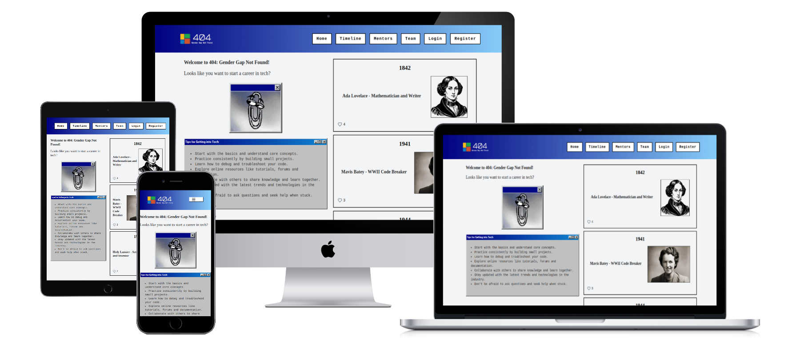

# 404: Gender Gap Not Found - Inspiring the Next Generation of Women in Tech



**404: Gender Gap Not Found** is a groundbreaking web application dedicated to celebrating the achievements of women in technology. By showcasing inspiring stories, offering valuable tech tips, and bridging the mentorship gap, our platform aims to empower the next generation of female innovators. We envision a future where diversity and inclusion drive progress—ensuring that the gender gap in tech is a challenge of the past.

Live site: [https://team-1-8284bb86c76b.herokuapp.com/](https://team-1-8284bb86c76b.herokuapp.com/)

 

---

## Table of Contents

- [404: Gender Gap Not Found - Inspiring the Next Generation of Women in Tech](#404-gender-gap-not-found---inspiring-the-next-generation-of-women-in-tech)
  - [Table of Contents](#table-of-contents)
  - [User Experience](#user-experience)
    - [Site Goals](#site-goals)
    - [Target Users](#target-users)
  - [Design](#design)
    - [Colour Scheme](#colour-scheme)
    - [Fonts](#fonts)
    - [Wireframes](#wireframes)
- [](#)
  - [Agile Methodology](#agile-methodology)
    - [Kanban Board](#kanban-board)
    - [User Stories](#user-stories)
  - [Features](#features)
    - [Header](#header)
      - [Header Section Overview](#header-section-overview)
    - [Structure and Design](#structure-and-design)
      - [Background Gradient](#background-gradient)
      - [Logo](#logo)
      - [Navigation Links](#navigation-links)
    - [Mobile Responsiveness](#mobile-responsiveness)
    - [Footer](#footer)
    - [Timeline](#timeline)
      - [Read more](#read-more)
      - [Honor Her - Heart](#honor-her---heart)
    - [Tips](#tips)
    - [Contact Mentor Form](#contact-mentor-form)
    - [Admin Panel](#admin-panel)
    - [Custom Error Pages](#custom-error-pages)
    - [Future Features](#future-features)
  - [Testing](#testing)
    - [Manual Testing](#manual-testing)
  - [Bugs](#bugs)
    - [Known Bugs](#known-bugs)
  - [Technologies and Languages](#technologies-and-languages)
    - [Languages Used](#languages-used)
    - [Technologies](#technologies)
    - [Deployment and Version Control](#deployment-and-version-control)
    - [Styling](#styling)
    - [Authentication](#authentication)
    - [Tools](#tools)
  - [🛠️ Local Development Setup](#️-local-development-setup)
    - [1️⃣ Clone the Repository](#1️⃣-clone-the-repository)
    - [2️⃣ Install Python Dependencies](#2️⃣-install-python-dependencies)
    - [3️⃣ Configure Environment Variables](#3️⃣-configure-environment-variables)
    - [4️⃣ Install Tailwind CSS](#4️⃣-install-tailwind-css)
    - [5️⃣ Apply Database Migrations](#5️⃣-apply-database-migrations)
    - [6️⃣ Start Development Servers](#6️⃣-start-development-servers)
  - [Deployment](#deployment)
    - [Creating A Fork](#creating-a-fork)
    - [Cloning Repository](#cloning-repository)

---

## User Experience

### Site Goals
Our app is designed to inspire tech innovators by:
- **Sharing Stories:** Highlighting the key milestones and achievements of women pioneers in technology.
- **Providing Tips:** Offering handy, practical tips for navigating the tech world.
- **Bridging Mentorship Gaps:** Connecting mentees with experienced mentors who can guide their professional journeys.

The web app strives to break barriers, close gender gaps, and cultivate a diverse, inclusive community where women can thrive as innovators, leaders, and changemakers. It’s not just about mentorship—it’s about building a stronger future for women in technology.

### Target Users
- **General Users:** Visitors interested in exploring milestones and biographies of women in tech.
- **Students and Learners:** Individuals looking for role models and guidance from mentors.
- **Authenticated Users:** Registered users who access additional features like mentor connections and honoring tech icons.
- **Researchers:** People seeking inspiration or detailed information about notable figures.
- **Administrators:** Those managing content such as timeline entries, biographies, and mentor connections.

---

## Design

### Colour Scheme


**Retro Vibe:** The design features a bold combination of Navy (`#000080`) and LightSkyBlue (`#87CEFA`) as seen in the footer gradient, evoking a nostalgic Windows 98 feel.
**High Contrast:** The dark navbar (`bg-gray-900`) paired with white text and borders ensures excellent readability on large screens.
**Accent Variety:** Subtle Silver (`#C0C0C0`) accents and well-defined hover effects add visual depth without detracting from the retro aesthetic.

### Fonts
The site uses fonts inspired by late 1990’s Web 1.0 aesthetics. In particular:

**Gentium Book Basic**
A timeless serif font designed for readability with elegant letterforms and extensive language support—ideal for biographies.


### Wireframes
Based on the user stories, we used Balsamiq to design the wireframes for the main UI, starting with mobile first.

<details>
  <summary>Header and Footer</summary>
<<<<<<<<< Temporary merge branch 1
  Wireframes for the site header and footer.
</details>
<details>
  <summary>Contact a Mentor</summary>
  Wireframes for the contact form for connecting with a mentor.
</details>
<details>
  <summary>Timeline</summary>
  Wireframes for the timeline:
  
  
  
=========
    Here are the wireframes for the site with its header and footer:


</details>
<details>
  <summary>Contact a Mentor</summary>
    Here are the wireframes for contact form for connecting with a mentor:


</details>
<details>
  <summary>Timeline</summary>
    Here are the wireframes for timeline:

   
      
    
>>>>>>>>> Temporary merge branch 2
</details>

---

## Agile Methodology

### Kanban Board
All user stories were logged on the [Kanban Project Board](https://github.com/users/tgrey2024/projects/21) on GitHub Projects. We used this board during development and testing to track progress, assign priorities, and log significant bugs.

### User Stories
Below are the prioritized user stories for the current implementation:

| User Stories                                    | MoSCoW Priority           |  Status |
|:----------------------------------------------- |:-------------------------:|:-------:|
| User-Friendly Navigation and Responsive Design  | must have                 |   Done  |
| Display Timeline View                           | must have                 |   Done  |
| Header and Footer                               | must have                 |   Done  |
| User Authentication                             | must have                 |   Done  |
| Connect with Mentors                            | must have                 |   Done  |
| Team Page                                       | must have                 |   Done  |
| Custom Error Pages                              | should have               |   Done  |

---

## Features

<<<<<<<<< Temporary merge branch 1
- **Header and Footer:** Consistent branding and easy navigation.
- **Timeline:** A retro-inspired timeline showcasing milestones of women in tech.
- **Tips:** Practical tech tips to empower users.
- **Contact Form:** An accessible way for users to get in touch.
- **Admin Panel:** Secure administration interface for managing content.
- **Error Pages:** Custom-designed error pages that align with the site’s aesthetic.
- **Future Features:** We're constantly refining our platform to better serve our community. Upcoming enhancements include more interactive timeline features, advanced mentor matching capabilities, and a wealth of new resources to empower the next generation of tech innovators. Stay tuned for regular updates as we expand our offerings and fine-tune the user experience.
=========
### Header

#### Header Section Overview
The header of this project is designed with a retro-modern and responsive layout to provide easy navigation across the site, with a touch of 1980s. It includes the following key components:
### Structure and Design
#### Background Gradient
* The header has a linear gradient that transitions from a dark blue (#000080) to a light sky blue (#87CEFA), giving it a visually appealing look. The text color is white, ensuring good contrast and readability.
#### Logo
* The logo is placed on the left side and links to the home page. It's styled to ensure that it fits well in the header without distorting or overflowing, using a max-w-full and max-h-full approach.
#### Navigation Links
* The horizontal navigation menu is displayed on larger screens (medium and up, md breakpoint) with links to key pages: Home, Timeline, Mentors, Team, Login and Register. These links have hover effects for better user interaction.
* If the user is authenticated, additional links for "Logout" and "Change Password" are displayed. Otherwise, users will see the "Login" and "Register" options.
### Mobile Responsiveness
* On smaller screens, the navigation links are hidden, and a hamburger menu (navbar-burger) appears.
* When clicked, it toggles a dropdown menu (navbar-dropdown) showing the same navigation links as in the desktop version.
* The dropdown menu is styled to appear below the hamburger button with a light background and rounded corners.
### Footer

* The footer is styled with a dark blue background (#000080), white text, and a subtle border on top.

* The text is centered, and the font is set to a monospace style (font-mono), with a small size (text-sm).

* It includes a copyright notice with the text "404 Gender Gap Not Found - Since 1900", followed by "All Rights Reserved".

* This footer is fixed at the bottom of the page (mt-auto), ensuring it stays at the bottom even if content above it is not enough to fill the screen.

### Timeline
* The timeline feature is a tribute to the trailblazing women who have shaped the world of technology through their pioneering achievements, starting with the pioneer, Ada Lovelace, often hailed as the world's first computer programmer. It presents an engaging and interactive journey through history, highlighting key figures and their groundbreaking contributions to fields like computing, engineering, game design, web accessibility and more. Each entry includes a snapshot of their life, notable accomplishments and the lasting impact of their work, providing inspiration for users of all ages. By showcasing these remarkable stories, the timeline not only honours these innovators but also encourages future generations to follow in their footsteps and continue breaking barriers in tech.

#### Read more
* The user is invited to know more about any figure by clicking on the Read more button to find out more about each tech icon.

#### Honor Her - Heart
* Users can honors the women featured on our timeline by giving them a heart - clicking on the heart icon.

### Tips
### Contact Mentor Form
* User may find a mentor from the pool of mentors on our mentors page.
* If a user finds no matching mentor right away, the user may click on the "Find a mentor" button
* A contact a mentor window will pop up and the user may provide his/heremial, mentor name and a message.
* The sytem will then try to match the user with a mentor.
### Admin Panel
The Admin Panel is set up for the admin or superuser to access and update the data in the database.

### Custom Error Pages
<!-- Add content for Error Pages here -->

### Future Features
>>>>>>>>> Temporary merge branch 2


## Testing

### Manual Testing
| Test Case                                        | Browser Compatibility                                  | Steps to Reproduce                                                                                      | Status |
|--------------------------------------------------|--------------------------------------------------------|---------------------------------------------------------------------------------------------------------|:------:|
| Responsive Navigation Bar (Desktop)              | Chrome, Firefox, Edge, Safari                          | 1. Open the site on a desktop browser<br>2. Verify nav links are visible and properly aligned          | ✔      |
| Responsive Navigation Bar (Mobile - Burger Menu) | Chrome (DevTools), Safari, Firefox, Edge               | 1. Open the site in a mobile viewport<br>2. Click on the burger icon<br>3. Verify dropdown appears      | ✔      |
| Home Page Rendering                              | Chrome, Firefox, Edge, Safari                          | 1. Visit the homepage URL<br>2. Verify the main content (image, text, layout) is rendered correctly       | ✔      |
| About Us Page with Team Section                  | Chrome, Firefox, Edge, Safari                          | 1. Visit `/about/` URL<br>2. Verify team members section displays correctly with images and GitHub links  | ✔      |
| User Authentication (Login/Registration Flow)    | Chrome, Firefox, Edge, Safari                          | 1. Visit login and registration pages<br>2. Submit forms with valid data<br>3. Confirm redirection to home | ✔      |
| Timeline Page Interaction                        | Chrome, Firefox, Edge, Safari                          | 1. Visit the timeline page<br>2. Interact with timeline elements and honour buttons<br>3. Verify proper functionality | ✔      |

---

## Bugs

### Known Bugs
*Details to be added:* List any known issues along with workarounds or planned fixes.

---

## Technologies and Languages

### Languages Used
- **HTML5:** For site structure.
- **CSS:** For styling.
- **Python:** Provides the site’s core functionality.
- **Django:** The Python framework powering the app.
- **JavaScript:** For interactive and dynamic elements.

### Technologies
- **node.js**

### Deployment and Version Control
- **Git** and **Github:** For version control.
- **Heroku:** Hosting the web application.
- **Whitenoise:** Serving static files.
- **Cloudinary:** Image storage.

### Styling
- **Tailwind CSS:** For responsive design.
- **FlyonUI:** For styling elements like the timeline.
- **Tabler:** For icons.

### Authentication
- **Django AllAuth**

### Tools
- **VS Code:** IDE for development.
- **Balsamiq:** For wireframe creation.
- **Canva, LogoAI:** For logo and design assets.
- **Favicon.io:** For favicon generation.
- **Copilot:** AI-powered code assistance.

---

Here’s a polished, easy‑to‑read **Markdown** version of your Local Development Setup instructions:

---

## 🛠️ Local Development Setup

Follow these steps to get the project running on your machine.

### 1️⃣ Clone the Repository

```bash
git clone https://github.com/tgrey2024/2503-hackathon-team1.git .
```
> The trailing `.` tells Git to clone into your **current directory**.

---

### 2️⃣ Install Python Dependencies

```bash
pip install -r requirements.txt
```

---

### 3️⃣ Configure Environment Variables

Create a `.env` file in the project root containing:

```dotenv
SECRET_KEY=<your_secret_key>
DEV=1
```
- **SECRET_KEY**: any secure random string
- **DEV**: enables Django’s debug mode for local development

---

### 4️⃣ Install Tailwind CSS

```bash
python manage.py tailwind install
```

---

### 5️⃣ Apply Database Migrations

```bash
python manage.py migrate
```

---

### 6️⃣ Start Development Servers

For the smoothest workflow, open **two terminal windows**:

| Terminal | Command                           | Purpose                         |
| -------- | --------------------------------- | ------------------------------- |
| 1        | `python manage.py tailwind start` | Watch & compile Tailwind CSS    |
| 2        | `python manage.py runserver`      | Start Django development server |

Once both are running, visit http://127.0.0.1:8000 in your browser to see the app live.

---


## Deployment

The web app is hosted on Heroku using Eco Dynos and is deployed via the designated GitHub repository.

**Deployment Process:**
1. Log in to your GitHub profile and **create a new repository**.
2. Open VS Code locally, connect to the workspace, and build the MVP.
3. Install the web server **gunicorn** and freeze requirements.
4. Create a new **Procfile** in the root directory specifying gunicorn as the process type.
5. Update `ALLOWED_HOSTS` in `settings.py` and set `DEBUG = False` for production. Commit and push these changes.
6. In Heroku, create a new app using a unique name and the correct region.
7. Add necessary **Config Vars** in the Heroku settings.
8. Go to the **Deploy** tab, connect the correct GitHub repository, and deploy the branch.
9. Choose **Automatic Deploy** for seamless updates.
10. Verify the deployed site using browser developer tools.
11. In the app's Resources tab, confirm Eco Dynos are in use and remove unnecessary add-ons.
12. Future changes should be pushed to GitHub and deployed on Heroku accordingly.

### Creating A Fork
If you'd like to contribute, fork the repository on GitHub by clicking the "Fork" button at the top-right of the repository page. This creates your own copy of the repository where you can work independently. Once you’ve made your changes, you can submit a pull request to merge your work into the main project.

### Cloning Repository
To clone the repository locally:
1. Navigate to the repository on GitHub.
2. Click the green "Code" button and copy the URL.
3. Open your terminal and run:
   ```bash
   git clone https://github.com/tgrey2024/2503-hackathon-team1.git
